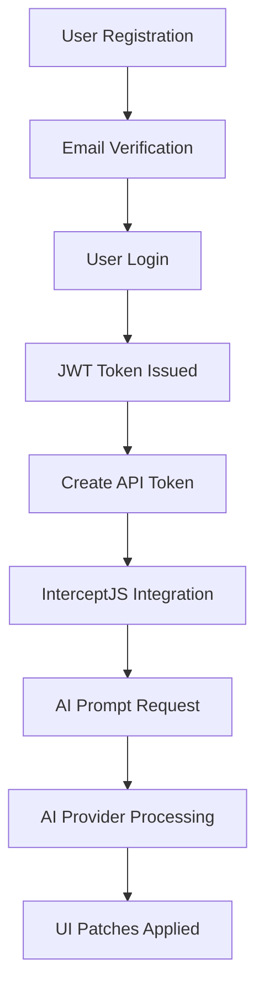

# Kuttl Backend Workflow Guide

## How the Backend Works

This guide explains the complete workflow of how the Kuttl API backend operates, from user registration to AI-powered UI customization.

## System Flow Overview



## Detailed Workflow

### 1. User Onboarding Flow

#### Step 1: User Registration
```http
POST /api/v1/auth/register
```

**What happens internally:**
1. Validate email format and password strength
2. Check if user already exists
3. Hash password using bcrypt
4. Create user record in PostgreSQL
5. Generate email verification token (future feature)
6. Return user data (without password)

**Database Impact:**
```sql
INSERT INTO users (id, email, password_hash, name, role, verified)
VALUES (uuid, email, bcrypt_hash, name, 'user', false);
```

#### Step 2: User Login
```http
POST /api/v1/auth/login
```

**What happens internally:**
1. Validate request format
2. Look up user by email
3. Verify password against stored hash
4. Generate JWT token with user claims
5. Create session record for tracking
6. Return user data + JWT token

**Database Impact:**
```sql
SELECT * FROM users WHERE email = ?;
INSERT INTO sessions (user_id, token_hash, ip_address, user_agent, expires_at);
```

### 2. API Token Management Flow

#### Creating API Tokens
```http
POST /api/v1/auth/tokens
Authorization: Bearer <jwt_token>
```

**What happens internally:**
1. Validate JWT token from Authorization header
2. Extract user ID from token claims
3. Generate cryptographically secure random token
4. Hash the token for storage (SHA-256)
5. Store token metadata in database
6. Return full token (only shown once!)

**Database Impact:**
```sql
INSERT INTO api_tokens (id, user_id, name, token_hash, token_prefix, expires_at, is_active);
```

**Security Note:** The actual API token is never stored - only its hash. This prevents token exposure even if the database is compromised.

### 3. Authentication Middleware Flow

#### JWT Authentication
```http
GET /api/v1/auth/profile
Authorization: Bearer <jwt_token>
```

**Middleware Process:**
1. Extract token from `Authorization: Bearer <token>` header
2. Validate JWT signature using secret key
3. Check token expiration
4. Extract user claims (ID, email, role)
5. Fetch current user data from database
6. Add user to request context
7. Continue to handler

#### API Key Authentication  
```http
POST /api/v1/prompt
X-API-Key: kuttl_abc123...
```

**Middleware Process:**
1. Extract token from `X-API-Key` header
2. Hash the provided token
3. Look up token in database by hash
4. Check if token is active and not expired
5. Update `last_used` timestamp
6. Fetch associated user data
7. Add user to request context
8. Continue to handler

### 4. AI Integration Workflow

#### AI Prompt Processing (Future Implementation)
```http
POST /api/v1/prompt
X-API-Key: kuttl_abc123...

{
  "prompt": "Make the header blue and bigger",
  "tree": { /* DOM tree */ },
  "selection": { /* selected element */ }
}
```

**Processing Flow:**
1. Authenticate request (JWT or API key)
2. Validate prompt and tree data
3. Forward request to AI provider (Anthropic/OpenAI/Gemini)
4. Process AI response into UI patches
5. Return structured patch operations
6. Log request for analytics

### 5. Database Connection Management

#### Connection Pooling
```go
// Configuration applied at startup
db.SetMaxOpenConns(25)      // Max concurrent connections
db.SetMaxIdleConns(5)       // Idle connections to keep
db.SetConnMaxLifetime(5m)   // Max connection lifetime
db.SetConnMaxIdleTime(2m)   // Max idle time
```

**Pool Management:**
- Automatically scales connections based on load
- Reuses idle connections for efficiency
- Closes long-lived connections to prevent issues
- Monitors connection health

#### Migration System
```bash
make migrate
```

**Migration Process:**
1. Check for `schema_migrations` table
2. Read migration files from `migrations/` directory
3. Compare with executed migrations in database
4. Run pending migrations in transaction
5. Record successful migrations
6. Rollback on failure

### 6. Request Lifecycle

#### Complete Request Flow
```
HTTP Request → CORS Middleware → Rate Limiter → Logger → Auth Middleware → Handler → Response
```

1. **CORS Middleware**: Handles cross-origin requests
2. **Rate Limiter**: Checks request frequency per IP
3. **Logger**: Records request details for monitoring
4. **Auth Middleware**: Validates authentication
5. **Handler**: Processes business logic
6. **Response**: Returns structured JSON

#### Request Logging
Every request is logged with:
```json
{
  "timestamp": "2024-01-01T12:00:00Z",
  "method": "POST",
  "path": "/api/v1/auth/login",
  "status": 200,
  "duration": "45ms",
  "ip": "192.168.1.100",
  "user_agent": "Mozilla/5.0..."
}
```

### 7. Error Handling Patterns

#### Validation Errors
```go
if req.Email == "" {
    response.BadRequest(w, "Email is required")
    return
}
```

#### Database Errors
```go
if err == sql.ErrNoRows {
    response.Unauthorized(w, "Invalid credentials")
    return
}
response.InternalError(w, "Database error")
```

#### Authentication Errors
```go
if claims.ExpiresAt.Time.Before(time.Now()) {
    response.Unauthorized(w, "Token expired")
    return
}
```

### 8. Rate Limiting Algorithm

#### Sliding Window Implementation
```go
type visitor struct {
    limiter  *rate.Limiter  // Token bucket limiter
    lastSeen time.Time     // Last request time
}
```

**Rate Limiting Process:**
1. Extract client IP from request
2. Look up or create rate limiter for IP
3. Check if request is allowed (token bucket)
4. Update last seen time
5. Allow or reject request
6. Clean up old visitors periodically

### 9. Security Measures

#### Password Security
- Minimum 8 characters required
- Bcrypt hashing with automatic salt
- Password never stored in plain text
- Secure comparison to prevent timing attacks

#### Token Security
- JWT tokens signed with HMAC-SHA256
- API tokens use cryptographically secure random generation
- All tokens hashed before database storage
- Token rotation and expiry supported

#### Database Security
- All queries use parameterized statements
- Input validation on all endpoints
- SQL injection prevention
- Connection encryption (configurable)

### 10. Monitoring & Health

#### Health Check System
```go
// Basic health check
GET /api/v1/health

// Detailed health with database stats
GET /api/v1/health/detailed
```

**Health Check Process:**
1. Test database connectivity
2. Execute simple query
3. Gather connection pool statistics
4. Return comprehensive health status
5. Set appropriate HTTP status codes

### 11. Configuration Management

#### Environment-Based Config
```go
cfg := &Config{
    DatabaseURL:    getEnv("DATABASE_URL", ""),
    JWTSecret:      getEnv("JWT_SECRET", ""),
    AIProvider:     getEnv("AI_PROVIDER", "anthropic"),
    // ... more config
}
```

**Configuration Priority:**
1. Environment variables (highest)
2. `.env` file
3. Default values (lowest)

**Validation:**
- Required fields checked at startup
- Format validation (URLs, keys, etc.)
- Fail fast on invalid configuration

### 12. Development vs Production

#### Development Mode
```bash
make dev  # Uses air for hot reload
```
- Hot reload on file changes
- Debug logging enabled
- Relaxed CORS settings
- Local PostgreSQL via Docker

#### Production Mode
```bash
make build-prod
```
- Optimized binary compilation
- Structured logging only
- Strict CORS settings
- Connection pooling optimized
- Health check endpoints for load balancers

## Integration with InterceptJS

### Frontend Integration Flow
```javascript
// 1. Initialize with API key
const intercept = InterceptJS.init({
  ai: {
    provider: 'anthropic',
    apiKey: 'kuttl_your_api_key'
  }
});

// 2. Make AI requests
const result = await intercept.prompt("Make it blue");

// 3. Backend processes and returns patches
// 4. InterceptJS applies patches to DOM
```

### Data Flow
```
InterceptJS → API Request → Authentication → AI Processing → Patch Generation → Response → DOM Updates
```

This backend provides a robust, secure, and scalable foundation for AI-powered UI customization with comprehensive authentication, monitoring, and error handling.